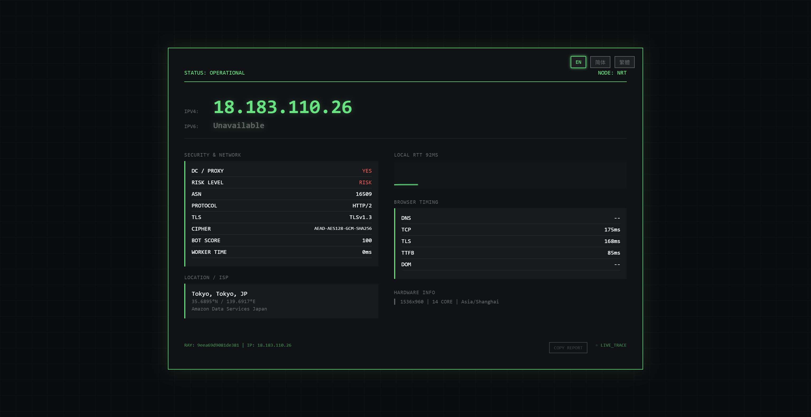

# 🌐 CF-workers-ipcheck
> 基于 Cloudflare Workers 构建的轻量级、无服务器 IP 信息查询工具，支持 IPv4/IPv6 双栈，一键部署即可全球低延迟访问。

---


---

## ✨ 项目亮点
- 🌐 **双栈全兼容**：自动识别并返回 IPv4 / IPv6 地址，完美适配所有网络环境
- 📍 **精准地理信息**：显示国家/地区/城市/Cloudflare 节点/时区，信息完整透明
- 🚀 **无服务器架构**：依托 Cloudflare 全球边缘节点，无需自建服务器，部署即上线
- ⚡ **毫秒级响应**：就近节点访问，全球低延迟体验，无任何访问卡顿
- 🎨 **美观响应式界面**：自带深色/浅色模式，适配桌面与移动端，颜值拉满
- 📡 **多格式 API 接口**：支持网页、纯文本、JSON 三种返回格式，脚本调用更方便
- 🛡️ **零依赖、轻量安全**：核心代码仅百余行，无外部依赖，无数据存储，隐私安全

---

## 🖼️ 演示截图


---

## 🚀 快速部署
### 方式一：控制台一键部署（新手推荐）
1. 登录你的 [Cloudflare Dashboard](https://dash.cloudflare.com/)
2. 进入 **Workers & Pages** → 点击 **创建应用** → **创建 Worker**
3. 给你的 Worker 命名（如 `ipcheck`），点击 **部署**
4. 点击 **编辑代码**，将 `_workers.js` 的全部代码粘贴进去
5. 点击右上角 **保存并部署**，访问你的 Worker 域名即可使用

### 方式二：Wrangler CLI 部署（开发者推荐）
```bash
# 克隆仓库
git clone https://github.com/ASIACOMKHK/CF-workers-ipcheck.git
cd CF-workers-ipcheck

# 安装依赖
npm install

# 本地调试（可选）
npm run dev

# 一键部署到 Cloudflare Workers
npm run deploy
```

---

## 📡 接口说明
| 路径 | 说明 | 返回格式 |
|------|------|----------|
| `/` | 网页版 IP 信息展示 | HTML 页面 |
| `/ip` | 仅返回访客公网 IP | 纯文本 |
| `/json` | 返回完整 IP 与地理信息 | JSON |

### 调用示例
```bash
# 获取纯文本 IP
curl https://你的域名.workers.dev/ip

# 获取完整 JSON 信息
curl https://你的域名.workers.dev/json
```

---

## 📁 项目结构
```
CF-workers-ipcheck/
├── _workers.js       # Workers 核心脚本文件
├── README.md         # 项目说明文档
├── wrangler.toml     # Wrangler CLI 配置文件
├── LICENSE           # MIT 开源协议
├── .gitignore        # Git 忽略配置
└── screenshot.png    # 项目演示截图
```

---

## 📌 FAQ 常见问题
### 1. 为什么显示的是 IPv6 而不是 IPv4？
这由你的网络环境决定，当设备/运营商优先使用 IPv6 时，会自动返回 IPv6 地址，脚本会如实获取当前真实出口 IP。

### 2. 地区信息显示不准确怎么办？
IP 地理信息来自 Cloudflare 内置 IP 库，部分代理、内网、特殊网络环境会影响定位精度，无法做到 100% 精准。

### 3. 可以绑定自己的域名吗？
可以。在 Cloudflare Workers 控制台的 **触发器** 中，添加自定义域名即可。

### 4. 有访问次数/流量限制吗？
遵循 Cloudflare Workers 免费套餐额度，个人日常使用完全足够，一般不会触发限制。

### 5. 可以用于商业项目吗？
可以。本项目基于 MIT 协议开源，你可以自由使用、修改和分发，无任何限制。

---

## 🎯 适用场景
- 快速查看本机公网 IP 与网络环境
- 脚本/程序自动获取当前出口 IP
- 网站访客 IP 统计与地区分析
- 网络调试、IPv4/IPv6 双栈连通性测试
- 学习 Cloudflare Workers 无服务器开发的入门示例

---

## 📄 License
[MIT License](LICENSE) © 2026 ASIACOMKHK

---

## 💬 反馈与贡献
- 有问题或建议？欢迎提交 [Issues](https://github.com/ASIACOMKHK/CF-workers-ipcheck/issues)
- 想优化功能？欢迎提交 [Pull Requests](https://github.com/ASIACOMKHK/CF-workers-ipcheck/pulls)
